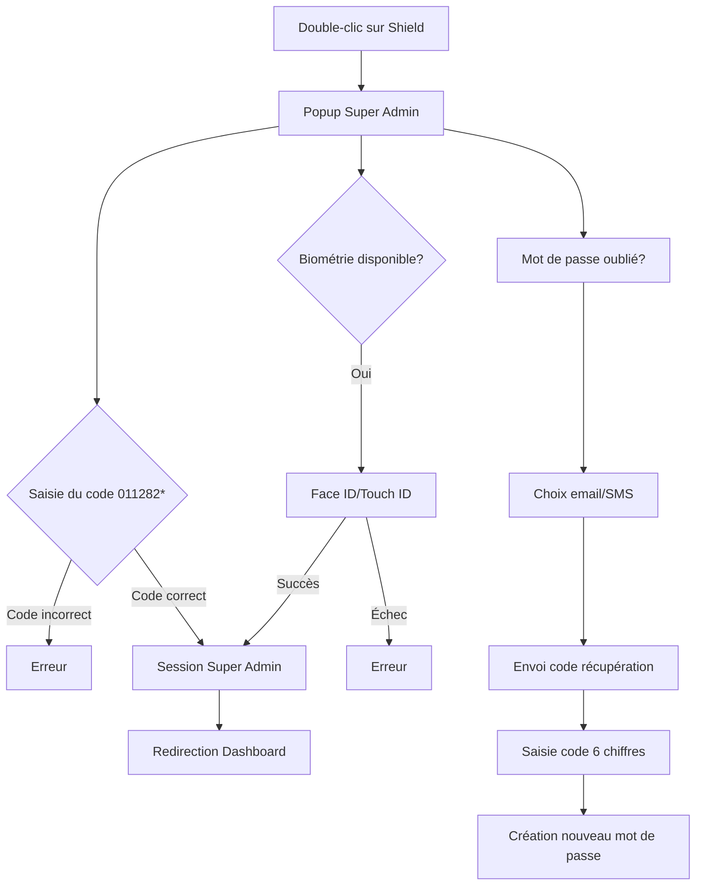

# Authentification Super Admin - NDJOBI

## 🔐 Vue d'ensemble

Le système d'authentification Super Admin est un accès exclusif et caché qui permet d'accéder directement au dashboard Super Admin sans passer par l'authentification standard.

## 🎯 Fonctionnalités

### Accès Caché
- **Déclencheur** : Double-clic sur l'icône Shield (🛡️) dans le titre "Authentification"
- **Visibilité** : Complètement caché, aucune indication visible
- **Interface** : Popup modal avec grille de mot de passe

### Authentification Simple

#### Authentification Principale
- **Code** : `011282*` (6 chiffres + 1 caractère spécial)
- **Format** : Format spécial non-standard
- **Accès** : Direct après validation du code
- **Pas de double authentification**

#### Récupération de Mot de Passe
- **Email** : `iasted@me.com`
- **Téléphone** : `YOUR_PHONE_NUMBER`
- **Usage** : Uniquement pour créer un nouveau mot de passe
- **Code** : Code de 6 chiffres généré automatiquement

### Authentification Biométrique (Mobile)
- **Face ID** : Disponible sur iOS
- **Touch ID** : Disponible sur iOS/Android
- **Détection** : Automatique selon les capacités de l'appareil
- **Bypass** : Contourne l'étape de validation par contact

## 🔧 Implémentation Technique

### Composants
- **`SuperAdminAuth.tsx`** : Modal d'authentification
- **`PhoneAuth.tsx`** : Gestion du double-clic sur l'icône Shield
- **`superAdminAuth.ts`** : Service de validation et gestion des sessions

### Sécurité
- **Session** : Stockage local avec expiration (24h)
- **Validation** : Double vérification (code + contact)
- **Biométrie** : WebAuthn pour l'authentification mobile
- **Logs** : Traçabilité des accès Super Admin

### Flux d'Authentification



## 📱 Utilisation

### Sur Desktop
1. Aller sur la page d'authentification (`/auth`)
2. Double-cliquer sur l'icône Shield (🛡️) dans le titre "Authentification"
3. Saisir le code : `011282*`
4. Accès automatique au dashboard Super Admin

### Sur Mobile
1. Aller sur la page d'authentification (`/auth`)
2. Double-cliquer sur l'icône Shield (🛡️)
3. Utiliser Face ID/Touch ID OU saisir le code `011282*`
4. Accès automatique au dashboard Super Admin

### Récupération de Mot de Passe
1. Dans le popup Super Admin, cliquer sur "Mot de passe oublié ?"
2. Choisir la méthode : Email ou SMS
3. Saisir le code de récupération reçu
4. Créer un nouveau mot de passe

## 🛡️ Sécurité

### Mesures de Protection
- **Code spécial** : Format non-standard (6 chiffres + caractère spécial)
- **Accès direct** : Pas de double authentification pour simplifier
- **Session limitée** : Expiration automatique après 24h
- **Biométrie** : Authentification forte sur mobile
- **Récupération sécurisée** : Code de récupération par email/SMS
- **Logs** : Traçabilité des accès

### Gestion des Erreurs
- **Code incorrect** : Message d'erreur générique
- **Récupération échouée** : Possibilité de renvoyer le code
- **Session expirée** : Reconnexion automatique requise
- **Biométrie échouée** : Fallback vers code d'accès

## 🔄 Maintenance

### Codes de Récupération
- **Génération** : Automatique côté serveur
- **Expiration** : 10 minutes par défaut
- **Renvoi** : Possible en cas d'échec
- **Usage** : Uniquement pour créer un nouveau mot de passe

### Session Super Admin
- **Durée** : 24 heures
- **Renouvellement** : Automatique lors des actions
- **Nettoyage** : Suppression automatique à l'expiration

### Monitoring
- **Accès** : Logs des tentatives d'authentification
- **Erreurs** : Traçabilité des échecs
- **Sessions** : Suivi des sessions actives

## 📋 Configuration

### Variables d'Environnement
```env
SUPER_ADMIN_CODE=011282*
SUPER_ADMIN_EMAIL=iasted@me.com
SUPER_ADMIN_PHONE=YOUR_PHONE_NUMBER
SUPER_ADMIN_SESSION_DURATION=86400000
```

### Personnalisation
- **Code d'accès** : Modifiable dans `superAdminAuth.ts`
- **Contacts de validation** : Configurables via variables d'environnement
- **Durée de session** : Ajustable selon les besoins
- **Interface** : Thème cohérent avec l'application

## 🚨 Notes Importantes

1. **Accès exclusif** : Seuls les Super Admins autorisés connaissent le code
2. **Sécurité** : Ne jamais exposer le code dans le code source
3. **Validation** : Toujours vérifier les codes côté serveur
4. **Sessions** : Nettoyer régulièrement les sessions expirées
5. **Logs** : Surveiller les tentatives d'accès non autorisées

## 🔧 Développement

### Tests
- **Code d'accès** : Tester avec le code correct et incorrect
- **Validation** : Vérifier l'envoi et la validation des codes
- **Biométrie** : Tester sur différents appareils mobiles
- **Sessions** : Vérifier l'expiration et le renouvellement

### Debug
- **Console** : Logs détaillés des étapes d'authentification
- **Storage** : Vérification des sessions dans localStorage
- **Network** : Surveillance des appels API de validation
- **Errors** : Gestion des erreurs avec messages utilisateur
